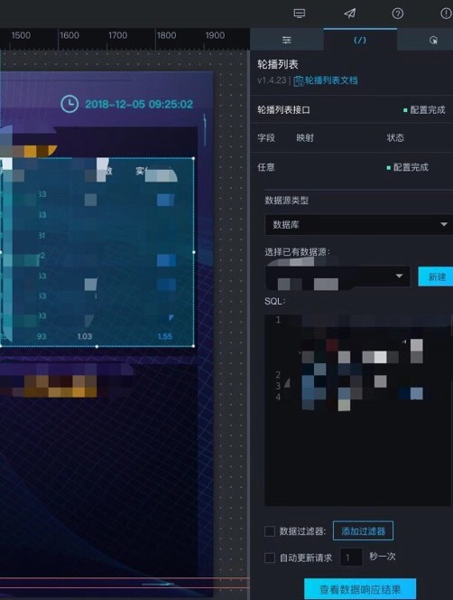
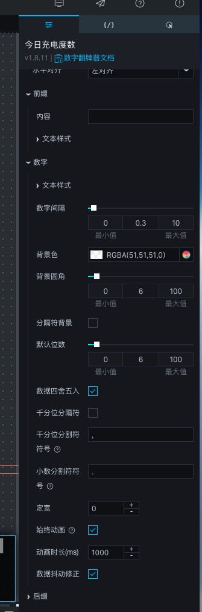
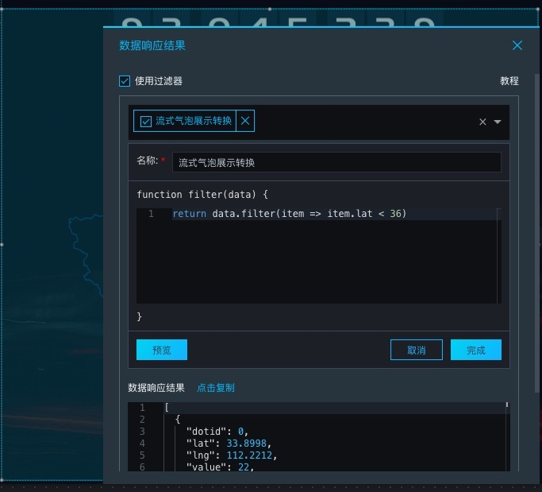

##  数据可视化-[DataV](https://help.aliyun.com/product/43570.html?spm=a2c4g.11186623.6.540.2c533dafIhfjrZ) 

### 版本和基本概念

拖拽式图形化的搭建工具（v4.0）
基础版：公开发布，8模板，5大屏
企业版：
开发者版：
本地部署版：大屏加密发布，支持外接组件库，例如 ECharts 和 G2 等，支持创建 20 个大屏项目

数据源：数据库类、文件类、API类、其他
画布：
工具栏：添加组件、预览、发布
组件：常规图表、地图、媒体、文字、关系网络、素材、交互等
……

### 不完全归纳使用过程中的一些小技巧

使用方法简单，对比[Tableau](https://github.com/RLwu/fe-note/tree/master/data-visualization-master/Tableau-master)，适合快速构建可视化项目

##### 数据源

可以添加多找那个数据源，下面是链接数据库

##### 配置

简单的配置实例

##### 过滤器

添加一个小过滤器

##### 封装指南

感兴趣的童鞋可以自己封装Echarts，不废话，文档介绍的很详细了…
